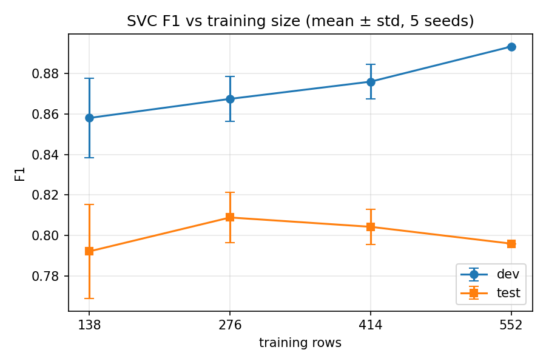

# ARI 510 Lab 1: Heart Disease Classification

**Roshkrishna K Ranjith**
University of Michigan–Flint, Fall 2026
Track: ARI 510 (Graduate)
Code: https://github.com/LUCIFER5671/pulse-check

## 1. Introduction

This report compares machine learning classifiers on a heart disease diagnosis task: predicting from clinical measurements whether a patient has heart disease. I followed the ARI 510 (graduate) track, designing the comparison protocol rather than running a fixed set of configurations.

The data is the UCI heart disease dataset, comprising 920 patient records from four hospitals (Cleveland, Hungary, Switzerland, VA Long Beach) with 15 features mixing continuous clinical measurements with categorical ones. The raw target records severity on a 0 to 4 scale, which I collapsed to a binary presence/absence label; 55.3% of patients have disease. The dataset is not clean, and the cleaning decisions turned out to matter more than the choice of classifier (Section 3.1).

I compared six classifier families: logistic regression, support vector machines, k-nearest neighbours, random forests, histogram-based gradient boosting, and a stochastic gradient descent classifier. Two baselines were included throughout: a majority-class classifier and a random classifier predicting at the training-set class rate. I report accuracy, precision, recall, F1, and F2, treating F1 as decisive for reasons set out in Section 3.4.

## 2. Hypothesis

I hypothesized that Random Forest would achieve the highest F1. The feature space mixes categorical variables (chest pain type, `thal`, `slope`) with continuous ones (age, cholesterol, maximum heart rate), and I expected clinically plausible nonlinear interactions: the significance of a given maximum heart rate should depend on the patient's age. Tree ensembles capture such interactions without manual feature engineering, need no feature scaling, and tolerate the heavy missingness in this data (66% for `ca`, 53% for `thal`). I expected logistic regression to trail, since it fits only a linear boundary in the encoded space. Given n=920, I expected any margin to be modest; ensembles generally need more data to separate from simpler models.

This hypothesis was formed after reviewing the lecture material and an initial inspection of the data, before any models were run.

## 3. Approach

### 3.1 Cleaning and encoding

The dataset contains 920 patients and 15 features. The raw target `num` records severity on a 0 to 4 scale; following the binary framing of the task, I collapsed it to disease present (`num > 0`) versus absent, giving 509 positive and 411 negative cases (55.3% positive).

Initial inspection revealed that missing values are not confined to the columns pandas reports as null. 172 rows record a serum cholesterol of 0 and one records a resting blood pressure of 0, both physiologically impossible, and both sentinel encodings for "not measured." Left untreated, these are read as genuine measurements and distort the feature. I converted both to NaN before any imputation, which raised the missing rate for `chol` from 3.3% to 22.0% (202 of 920 rows).

The columns `fbs` and `exang` load as booleans with missing entries. I mapped these to 1/0 while preserving NaN, so that "not recorded" remains distinct from "false" rather than collapsing into the negative class.

Missingness in this dataset is substantial and highly structured: `ca` is 66.4% missing, `thal` 52.8%, and `slope` 33.6%. Crucially, these rates vary by source hospital; `ca` is 2% missing at Cleveland but 99% missing at Hungary and VA Long Beach. Since the hospitals also differ sharply in disease prevalence (36.2% at Hungary against 93.5% at Switzerland), the pattern of missingness carries information about the label. I therefore retained missingness indicators rather than discarding this signal, and return to its consequences in the error analysis (Section 5).

I dropped the `dataset` column, which records the source hospital, from the default feature set. It is a confounder rather than a clinical variable: a model can improve its score by inferring which hospital a patient came from instead of assessing the patient. An ablation measuring what this costs is reported in Section 4.

### 3.2 Avoiding leakage

All preprocessing, meaning imputation, scaling, and one-hot encoding, is implemented as a `ColumnTransformer` inside a scikit-learn `Pipeline`, so that every transformer is fit on training data only and applied unchanged to dev and test.

This departs from the provided starter notebook, which calls `X.fillna(X.median())` and `pd.get_dummies(X)` on the complete frame before splitting. Doing so computes imputation values from all 920 patients, including those later assigned to dev and test, so information from the held-out sets influences the training data. The effect on a dataset this clean is likely small, but the practice invalidates the held-out sets as estimates of performance on unseen data, which is the entire reason for holding them out.

### 3.3 Data splitting

I used a stratified 60/20/20 split into train (552), dev (184), and test (184), with stratification preserving the 55.3% positive rate in all three sets. Model selection and hyperparameter search were conducted entirely on the dev set. The test set was evaluated once, after the final configurations were fixed; no result from it was used to revise any choice.

### 3.4 Choice of decisive metric

I report accuracy, precision, recall, and F1 throughout, and initially intended F2 as the decisive metric. The reasoning was clinical: in a screening task, a false negative (a patient with disease sent home) carries a higher cost than a false positive (an unnecessary follow-up test), and F2 weights recall above precision accordingly.

Testing this choice against the baselines showed it to be unworkable. The majority-class baseline, which predicts "disease" for every patient, achieves an F2 of 0.8615 on the dev set, while a tuned logistic regression achieves 0.8743. A gap of 0.013 separates a real model from a classifier that examines no features at all. The cause is structural: this dataset has a positive majority, so the constant positive classifier attains perfect recall by construction, and F2's emphasis on recall rewards precisely that degeneracy.

I therefore adopted F1 as the decisive metric. On the same comparison, F1 gives 0.7133 for the majority baseline against 0.8768 for logistic regression, a gap of 0.164 that discriminates. The clinical asymmetry is retained as a secondary criterion: among configurations whose F1 differences fall within noise, I prefer the higher recall. All five metrics are reported for every configuration so the trade-off remains visible.

I note that this decision was made before any test-set evaluation, on the basis of baseline behaviour alone. The fact that the majority baseline still outperforms the final model on F2 at test time is taken up in Section 6; it is a consequence of the metric's structure, not a reason to revisit the choice after the fact.

### 3.5 Model comparison

I compared six classifier families: logistic regression, support vector machines, k-nearest neighbours, random forests, histogram-based gradient boosting, and a stochastic gradient descent classifier. The search covered 88 configurations in total, with grids given in Table 1. Every configuration was trained on the train split and scored on dev.

Two baselines were included, as required: a majority-class classifier, and a random classifier that predicts at the training-set class rate. The latter was computed analytically over 10,000 simulated prediction sets and validated against scikit-learn's per-draw metrics on 200 draws, matching to four decimal places.

## 4. Results

### 4.1 Dev-set comparison

Table 1 gives the best configuration for each classifier family, selected by F1 on the dev set, together with the two baselines. The full table of all 88 configurations is in `results/dev_results.csv`.

**Table 1.** Best dev-set configuration per model family.

| Model | Best configuration | Acc | Prec | Rec | F1 | F2 |
|---|---|---|---|---|---|---|
| SVM | RBF, C=1, gamma=scale, balanced | 0.880 | 0.885 | 0.902 | **0.893** | 0.898 |
| Random Forest | depth=None, leaf=1, balanced | 0.875 | 0.884 | 0.892 | 0.888 | 0.890 |
| Logistic Regression | C=0.1, balanced | 0.870 | 0.890 | 0.873 | 0.881 | 0.876 |
| SGD | log_loss, alpha=0.01, balanced | 0.870 | 0.890 | 0.873 | 0.881 | 0.876 |
| k-NN | k=11, uniform | 0.864 | 0.867 | 0.892 | 0.879 | 0.887 |
| HistGradientBoosting | lr=0.05, depth=3 | 0.864 | 0.881 | 0.873 | 0.877 | 0.874 |
| Majority baseline | always predict disease | 0.554 | 0.554 | 1.000 | 0.713 | 0.862 |
| Random baseline | predict at class rate | 0.506 | 0.554 | 0.552 | 0.552 | 0.552 |

Every model comfortably beats both baselines on F1. The six models, however, span only 0.016 F1 between first and last. With 184 dev examples, a single changed prediction moves F1 by roughly 0.005, so the gap between the best and worst model is on the order of three patients. The dev set cannot support a ranking at this resolution.

The SGD classifier ties logistic regression exactly on all five metrics. This is expected rather than coincidental: with `log_loss`, `SGDClassifier` fits the same logistic regression model by a different optimizer, and on a problem this small both converge to effectively the same decision boundary.

### 4.2 Confirming the ranking with repeated cross-validation

Because the dev set could not separate the models, I ran repeated stratified cross-validation (5 folds, 6 repeats, 30 fits) on the training split only, using identical folds for every model so the per-fold differences could be paired. The dev and test sets were not touched.

**Table 2.** Repeated cross-validation on the training split (n=552, 30 folds).

| Model | CV F1 (mean ± std) | Paired diff from SVM (mean / std) | Separable? |
|---|---|---|---|
| SVM | 0.8362 ± 0.0284 | — | — |
| k-NN | 0.8287 ± 0.0295 | 0.0075 / 0.0189 | No |
| HistGradientBoosting | 0.8287 ± 0.0296 | 0.0075 / 0.0247 | No |
| Logistic Regression | 0.8266 ± 0.0288 | 0.0096 / 0.0173 | No |
| Random Forest | 0.8241 ± 0.0299 | 0.0121 / 0.0233 | No |
| SGD | 0.8205 ± 0.0331 | 0.0157 / 0.0224 | No |
| Majority baseline | 0.7118 ± 0.0021 | 0.1244 / 0.0286 | Yes |

For every pair, the mean advantage of the SVM is smaller than the fold-to-fold standard deviation of that same difference. Only the majority baseline separates. The two ranking procedures also disagree with each other: Random Forest placed second on dev and last in cross-validation, which is itself evidence that the differences between models are not real.

The SVM was carried forward to the test set as the model that ranked first under both procedures. This was a pre-stated tie-breaking rule, not a preference formed after the fact; logistic regression would have been an equally defensible choice, and Section 6 returns to this.

### 4.3 Test-set results

The test set was evaluated once, with the configuration fixed.

**Table 3.** Final test-set performance (n=184).

| Model | Acc | Prec | Rec | F1 | F2 |
|---|---|---|---|---|---|
| SVM (RBF, C=1, balanced) | 0.777 | 0.808 | 0.784 | **0.796** | 0.789 |
| Majority baseline | 0.554 | 0.554 | 1.000 | 0.713 | 0.862 |
| Random baseline | 0.505 | 0.554 | 0.552 | 0.552 | 0.552 |

Test F1 of 0.796 sits below both the dev estimate (0.893) and the cross-validation estimate (0.836 ± 0.028), a little over one standard deviation below the latter. Section 6 discusses why the cross-validation figure is the more trustworthy estimate of generalization.

Note that the majority baseline still exceeds the final model on F2 (0.862 against 0.789), for exactly the structural reason set out in Section 3.4.

### 4.4 Data-value ablation

I retrained the chosen configuration on 25%, 50%, 75%, and 100% of the training split (stratified subsamples, five seeds per size, dev and test held fixed) and scored each on both dev and test.

**Table 4.** F1 against training-set size, averaged over five seeds.

| Training rows | Dev F1 | Test F1 |
|---|---|---|
| 138 (25%) | 0.858 | 0.792 |
| 276 (50%) | 0.867 | 0.809 |
| 414 (75%) | 0.876 | 0.804 |
| 552 (100%) | 0.893 | 0.796 |

**Figure 1.** Dev and test F1 as a function of training-set size. Error bars show the standard deviation across five stratified subsamples; the deviation is zero at 100% because all seeds use the full training set and the SVM is deterministic.

Dev F1 rises steadily with training size, from 0.858 to 0.893. Test F1 is flat within noise across the whole range, varying between 0.792 and 0.809 with no trend. On the test set, additional data beyond roughly 276 examples did not improve performance.

The gap between the two curves is constant at every training size, which indicates that the dev/test difference is a property of the splits rather than an artifact of any particular fit.

### 4.5 Site ablation

As an additional ablation, I refit the chosen configuration with the source hospital column retained rather than dropped.

**Table 5.** Effect of retaining the source hospital column.

| `dataset` column | Features | Test F1 | Test accuracy |
|---|---|---|---|
| Dropped | 27 | 0.796 | 0.777 |
| Kept | 31 | 0.816 | 0.799 |

Keeping the site column improves test F1 by 0.020, roughly four patients out of 184. This reverses the direction seen earlier on dev. The result is reported as an observation only: it was measured on the test set, and using it to choose a configuration would convert the test set into a second development set and invalidate the final estimate. Settling the question properly would require the same paired cross-validation procedure as Section 4.2, run on the training data alone. Section 5 shows in any case that dropping the column does not produce a site-independent model.

## 5. Error Analysis

## 6. Discussion

## 7. Generative AI Use Statement